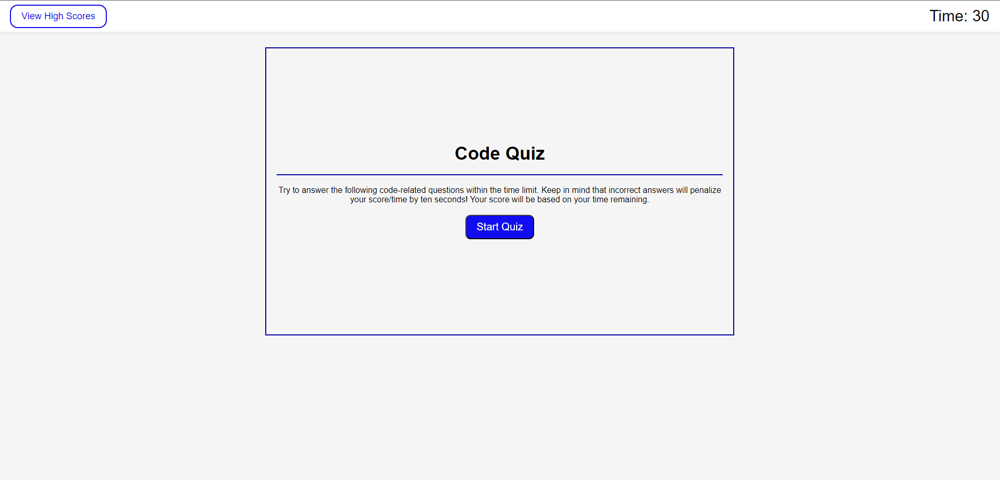

# Code Quiz

This is a timed quiz meant to challenge you to answer the questions in a quick manner.

## Instructions

Click "Start Quiz" to begin your 30 second, timed quiz. Each wrong answer will deduct 5 seconds off your time remaining. When all questions are answered, or time reaches 0, the quiz will end. IF your time is not 0 at the end of the quiz, submit your initials and score to be added to the "View High Scores" page. If your time is 0, simply click "Submit" and it will take you back to the start of the quiz.

## License

[MIT License](https://choosealicense.com/licenses/mit/)

## Start Preview
